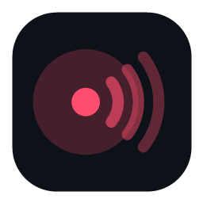

<p align="center">
  
</p>

<h1 align="center">Beamcast</h1>

<p align="center">
  <strong>Salas de compartilhamento de tela, self-hosted e cifradas de ponta a ponta.</strong><br />
  Projeto de estudo sobre captura, codecs, áudio por processo e transmissão em tempo real no Windows.
</p>

<p align="center">
  
  
  
  
</p>

---

## Leia isto primeiro

**O Beamcast existe apenas para estudo.** Ele foi escrito para explorar como captura de tela,
codificação de vídeo por hardware, áudio por processo e um protocolo de transmissão se
encaixam no Windows, e para produzir conclusões e código de referência para um aplicativo
empresarial separado e privado. Cada decisão prioriza aprendizado e medição, não uso em produção.

- **Sem garantia, sem responsabilidade.** O software é fornecido "como está". O autor não se
  responsabiliza por nada que aconteça ao executar, distribuir ou construir em cima dele.
- **Qualquer outro uso é responsabilidade sua.** Se você usar o Beamcast para algo além de
  estudar o código, faz isso por sua conta e risco, e é responsável por cumprir as leis,
  políticas e exigências de consentimento que se aplicam a você. Compartilhar a tela expõe
  tudo o que estiver nela; pense antes de transmitir.
- **Sem suporte, sem promessa de roadmap.** Issues podem ficar sem resposta; o protocolo e a
  organização dos arquivos podem mudar a qualquer momento.
- **Não é endurecido para produção.** O conteúdo vai cifrado de ponta a ponta e a senha nunca
  trafega, mas não houve auditoria de segurança. Use em ambientes que você controla.

O mesmo aviso aparece dentro do app no primeiro uso e na página Sobre.

## Como funciona

1. Alguém sobe o **host** (o servidor, um container Docker) em qualquer máquina alcançável:
   um VPS, o PC de casa atrás de um túnel, um servidor na LAN. Um host tem quantas salas quiser.
2. No app, você adiciona o host à sua lista (e pode favoritá-lo). Ao selecioná-lo, vê as
   **salas públicas** dele, suas **salas favoritas** naquele host, um campo para **código ou
   convite**, e o botão **Criar sala**.
3. Uma sala tem nome, visibilidade (**pública** aparece na lista; **privada** só entra por
   código ou convite), duração (**permanente** ou **temporária**, que some depois de ficar vazia
   pelo tempo escolhido), **senha opcional**, quem pode transmitir (todo mundo ou só o dono) e
   limite de pessoas.
4. Dentro da sala todo mundo vê quem está online e quais transmissões existem. Qualquer membro
   transmite (várias ao mesmo tempo, salvo se o dono restringir), cada um escolhe o que assistir
   e pode parar sem sair.
5. O **dono** (quem criou) gera **convites com validade** (1 h, 24 h, 7 dias ou sem prazo) e
   número de usos, edita a sala, troca ou remove a senha, expulsa gente e apaga a sala. O token
   de dono fica só no PC de quem criou, protegido pelo Windows (DPAPI).
6. Se a internet cair, do seu lado ou do host, o app **reconecta sozinho** por até 5 minutos,
   republica a sua transmissão e volta a assistir o que você assistia. A sala continua existindo
   no host; ninguém precisa reenviar convite.

## Segurança

O host nunca recebe senha nem chave e não consegue ver nem ouvir nada:

```
Salas com senha
  chave       = PBKDF2-SHA256(senha, salt, 200 000 rodadas)   fica só nas máquinas dos membros
  verificador = HMAC(chave, "verify")                          o host guarda isto na criação
  prova       = HMAC(verificador, nonce)                        quem entra envia; o host confere
  conteúdo    = HKDF(chave, "content")                          AES-256-GCM em nomes, títulos, vídeo e áudio

Salas sem senha
  chave da sala = aleatória, gerada pelo primeiro a entrar e guardada só pelos membros
  quem entra manda uma chave pública efêmera (ECDH P-256); um membro embrulha a chave da sala
  para ela (HKDF + AES-256-GCM) e o host apenas repassa o pacote, sem conseguir abri-lo

Convites e dono
  o convite carrega host, código, um token com validade/usos (o host guarda só o hash) e, em
  salas com senha, a chave de conteúdo; o token de dono também é guardado só como hash
```

Entradas erradas (senha, convite, código) são limitadas por endereço e por sala com janela de
10 minutos. Salas privadas usam códigos de 10 caracteres. O host só lê o tipo de cada mensagem
e a flag de keyframe, que usa para descartar quadros de um espectador lento e pedir um keyframe
ao transmissor sem prejudicar os outros.

## Subir o host (quem hospeda)

Precisa só de Docker com Compose. Sem Actions, sem registry, sem conta:

```bash
git clone https://github.com/lbss9/Beamcast.git
cd Beamcast
docker compose up -d --build
```

O host escuta na porta `47710`. No app, o endereço é `ws://SEU-IP:47710` (ou só `SEU-IP`).
Variáveis opcionais num `.env` ao lado do `docker-compose.yml`:

| Variável | Efeito |
| --- | --- |
| `BEAMCAST_PORT` | porta publicada no host (padrão `47710`) |
| `BEAMCAST_HOST_NAME` | nome que o app mostra para este host (padrão: nome da máquina) |
| `BEAMCAST_APP_KEY` | quando definida, o app precisa carregar a mesma chave (tela Salas → menu do host → "Chave do app…") |
| `BEAMCAST_LOUNGE_TTL_HOURS` | tempo padrão que uma sala **temporária** sobrevive vazia (padrão `24`) |

As salas (código, nome, configurações, salt e verificador, hashes de convites e do dono; nunca
conteúdo) ficam no volume `beamcast_data` e sobrevivem a reinícios. `GET /health` mostra salas,
membros e transmissões ativos; `GET /rooms` lista as salas públicas.

**Pela internet:** abra a porta `47710/tcp` no roteador, ou coloque o container atrás de um
reverse proxy/túnel com TLS (Cloudflare Tunnel, Caddy, nginx) e use `wss://seu-host` no app.
Como todo membro só faz conexão de saída, CGNAT e firewall de quem entra não importam.

**Banda:** o host recebe cada transmissão uma vez e reenvia uma vez por espectador. 1080p60 a
~12 Mbps por espectador; 4K60 H.264 a ~40 Mbps; HEVC gasta ~35% menos.

## O que o app faz

- **Captura** de monitor por DXGI Desktop Duplication (sem a borda amarela do Windows, cursor desenhado
  na GPU) e de janela pela Windows Graphics Capture API; tudo fica na GPU.
- **Vídeo**: conversão BGRA→NV12 no D3D11 Video Processor e encoder H.264/HEVC por hardware via
  Media Foundation (AMD, NVIDIA, Intel, D3D12) com perfil de baixa latência; VP8 por software
  como reserva. Decodificação DXVA direto para um `SwapChainPanel`.
- **Áudio**: loopback **por processo** (a mesma API que Discord e Teams usam). Ao compartilhar
  uma janela, captura só o app dela; ao compartilhar a tela inteira, captura todos os apps com
  sessão de áudio **exceto** Discord, Teams, Zoom, Slack, WhatsApp e afins, para a voz da chamada
  não ser retransmitida. Mixagem em quadros de 20 ms e Opus a 128 kbps, com ocultação de perda
  no receptor.
- **Rede**: um WebSocket por membro, heartbeat a cada 10 s (quem some é removido em 30 s mesmo
  atrás de proxy), mensagens cifradas, keyframe sob demanda, fila por espectador no host,
  reconexão automática. Presets até 2160p/120 fps.

## Compilar

Requisitos: Windows 10 1809+ (Windows 11 recomendado; áudio por processo pede build 20348+),
.NET 8 SDK.

```powershell
dotnet build Beamcast.sln -c Release
dotnet test tests/Beamcast.Tests
dotnet run --project src/Beamcast
```

O host também roda sem Docker: `dotnet run --project src/Beamcast.Server` (porta 8080).
`scripts/pack.ps1` gera o MSI com Velopack; os workflows do GitHub publicam o release do app
a partir da versão do csproj, e o app procura atualizações no GitHub Releases.

Para depurar, crie um arquivo vazio `%LOCALAPPDATA%\Beamcast\diag.on` (ou defina
`BEAMCAST_DIAG=1`): o app escreve `diag.log` na mesma pasta com eventos de encoder, keyframe e
fila.

## Organização

```
src/Beamcast          app WinUI 3
├── Capture/          Windows.Graphics.Capture + D3D11, enumeração de fontes
├── Codec/            VP8, encoders/decoders Media Foundation, conversor de vídeo
├── Audio/            loopback por processo, seletor de fontes, mixer, Opus, player
├── Net/              protocolo das salas, criptografia, convites, cliente, limitador
├── Services/         LoungeService (sala + reconexão), BroadcastService, WatchService, UpdateService
└── Pages/            Salas (hosts e listagem), Sala, diálogos, Configurações, Sobre
src/Beamcast.Server   host (ASP.NET Core, WebSocket + listagem HTTP)
tests/Beamcast.Tests  testes xunit das partes de lógica pura
docker-compose.yml    sobe o host a partir do código
```
